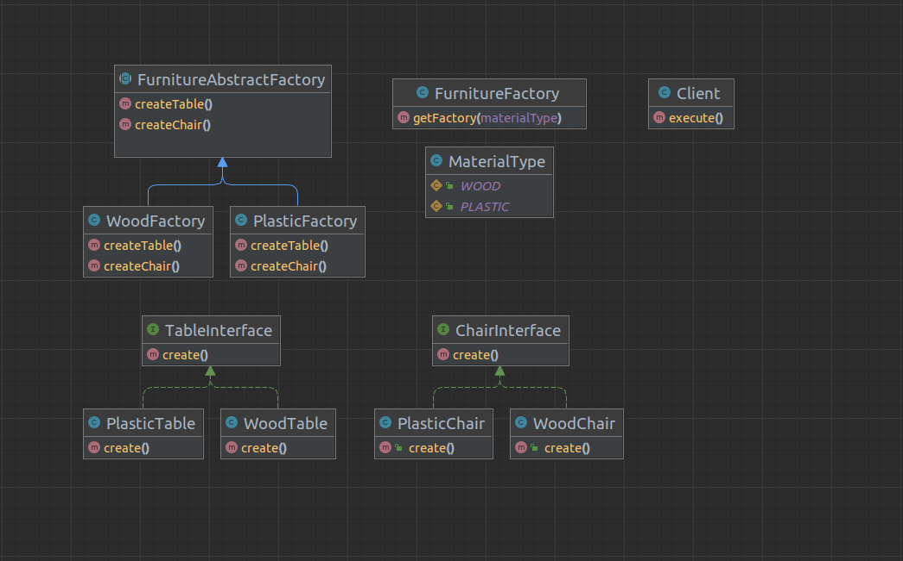

# Purpose 
*"**Abstract Factory** is a creational pattern that provides an interface for creating families of related or dependent objects without specifying their concrete classes."*

- Abstract Factory là một Creational Factory. Nó là phương pháp tạo ra một Super Factory để tạo ra các các factory khác, hay còn gọi là factory của factory. Abstract Factory Pattern là một Pattern cấp cao hơn so với Factory Method Pattern.
- Abstract Factory pattern cung cấp một interface có nhiệm vụ tạo ra một Factory của các objects có liên quan tới nhau mà không cần phải chỉ ra trực tiếp class của object.

## Which problem that design pattern can be resolved?
1. Cung cấp hướng tiếp cận với Interface thay vì các implement, che giấu sự phức tạp của việc khởi tạo các đối tượng với người dùng(client), đọc lập giữa việc khởi tạo đối tượng và hệ thống sử dụng.
2. Tránh được việc sử dụng điều kiện logic bên trong Factory Pattern. Với một Factory Method lớn, có quá nhiều xử lý if else hay switch case, chúng ta nên sử dụng theo mô hình Abstract Factory để dễ quản lý hơn.
3. Abstract Factory Pattern là factory của các factory, có thể dễ dạng mở rộng để chứa thêm các factory và các subclasses khác.
4. Dễ dàng xây dựng một hệ thống đóng gói (encapsulate): sử dụng được với nhiều nhóm đối tượng (factory) và tạo nhiều product khác nhau.

## How to install Abstract Factory Pattern?

**An Abstract Factory Pattern consists of the following basic components:**
- **Abstract Factory**: khai báo dạng interface hoặc abstract class chứa các phương thức để tạo ra các đối tượng abstract.
- **ConcreteFactory**: Xây dựng, cài đặt các phương thức tạo các đối tượng cụ thể.
- **AbstractProduct**: Khai báo dạng interface hoặc abstract class để định nghĩa đối tượng abstract.
- **Product**: Cài đặt các đối tượng cụ thể, cài đặt các phương thức được quy định tại Abstract Product.
- **Client**: là đối tượng sử dụng AbstractFactory và AbstractProduct.

# UML Diagram

 