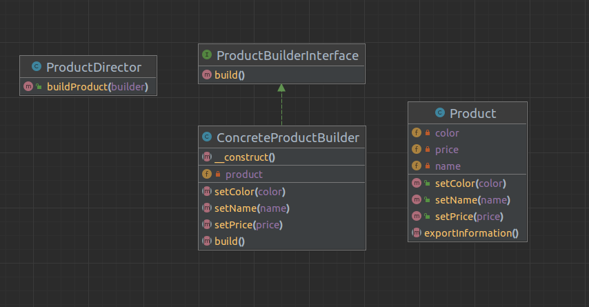

# Purpose 
*"**Builder** is a creational design pattern that separate the construction of a complex object from its representation so that the same construction process can create different representations."* 

**Translate**: Builder pattern là một trong những **Creational pattern**. Builder pattern là mẫu thiết kế đối tượng được tạo ra để xây dựng một đối tượng phức tạp bằng cách sử dụng các đối tượng đơn giản và để tiếp cận / xây dựng từng bước.

## Which problem that design pattern can be resolved?
1. Giảm bớt số lượng constructor
2. Không cần truyền giá trị null cho các tham số không dùng đến
3. Đối tượng xây dựng an toàn hơn, bởi vì nó được xây dựng hoàn chỉnh trước khi sử dụng 
4. Code dễ đọc dễ bảo trì hơn

## How to install Abstract Factory Pattern?
Một Builder sẽ bao gồm các thành phần cơ bản sau:
1. Product: đại diện cho đối tượng cần tạo, đối tượng này phức tạp, có nhiều thuộc tính. 
2. Builder: là abstract class hoặc interface, nó sẽ chịu trách nhiệm khai báo phương thức tạo đối tượng.
3. ConcreteBuilder: Kế thừa Builder và cài đặt chi tiết cách tạo ra đối tượng. Nó sẽ xác định và nắm giữ các thể hiện mà nó đã tạo ra, đồng thời nó cũng cung cấp phương thức để trả các thể hiện mà nó đã tạo ra trước đó.
4. Director/Client: là nơi sẽ gọi tới Builder để tạo đối tượng.

# UML Diagram

 