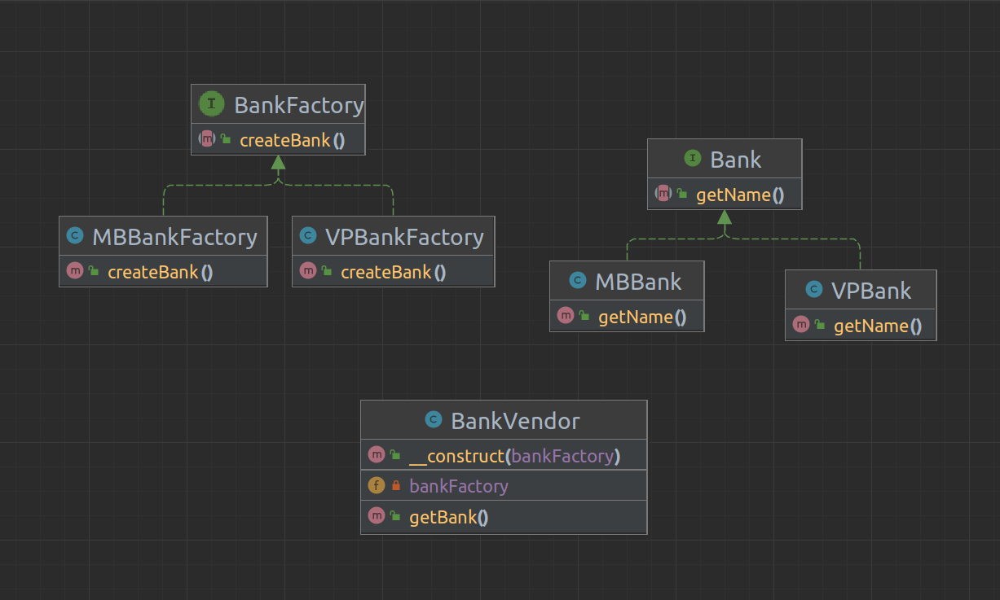

# Purpose 
Factory Method is a design pattern that defines an interface for creating an object, but let subclasses decide which class to instantiate. The Factory Method lets a class defer instantiation it uses to subclasses.

## When do we use Factory Method design pattern?
1. We have a super class with multiple subclasses and based on input type. We need to return one of the subclasses. This model helps us shift the responsibility of initializing a class from the client to the Factory class.

    
**Translate:**
*Chúng ta có một super class với nhiều class con và dựa trên đầu vào, chúng ta cần trả về một class con. Mô hình này giúp chúng ta đưa trách nhiệm của việc khởi tạo một lớp từ phía người dùng (client) sang lớp Factory.*

2. We don't know which subclasses will be needed in the future. When there's a need for expansion, create a new subclass and implement the Factory Method for initializing this new subclass.

**Translate:**
*Chúng ta không biết sau này sẽ cần đến những lớp con nào nữa. Khi cần mở rộng, hãy tạo ra sub class và implement thêm vào factory method cho việc khởi tạo sub class này.*

## What are the benefits of Factory Method pattern?
...

**Translate:**
- Giúp giảm sự phụ thuộc giữa các module, giúp chương trình độc lập vỡi những class cụ thể mà chúng ta cần tạo object.
- Code ở client không bị ảnh hưởng khi thay đổi logic ở factory hay subclass.
- Mở rộng code dễ dàng hơn: khi mở rộng chỉ việc tạo ra subclass mới và implement thêm vào Factory Method
- Khởi tạo Objects mà che giấu đi logic xử lý của việc khởi tạo ấy. Người dùng không biết logic thực sự được khởi tạo bởi phương thức Factory.

---

## How do we implement Factory Method design pattern?

Một Factory Method bao gồm các thành phần cơ bản sau: 
- Super Class: có thể là một Interface, Abstract class, hoặc một class thông thường
- Sub Classes: các subclasses sẽ implement các phương thức của super class theo nghiệp vụ riêng của nó
- Factory Class: một class chịu trách nhiệm khởi tạo các đối tượng sub class dựa theo tham số đầu vào. Chú ý: class này là một **Singleton** hoặc cung cấp một **public static method** cho việc truy xuất và khởi tạo đối tượng. Factory class sử dụng if-else hoặc switch-case để xác định class con đầu ra. Hoặc, triển khai các Subclasses Factory implement Factory class đó như trong URL Diagram bên dưới.

---

# UML Diagram 

 