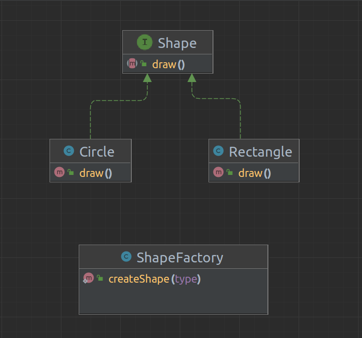

# Purpose 
The Simple Factory pattern is used to create objects without having to explicitly specify the exact class of the object. Instead of directly instantiating the object using the New keyword, you use a method of a factory class to create the object.

---
# UML 

 